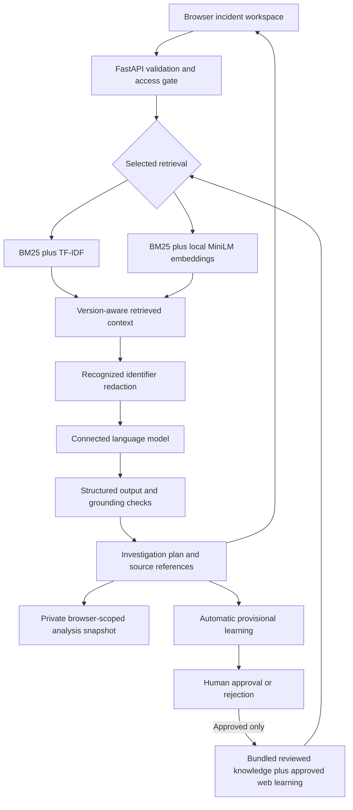

# Pocket FDE — Project Report

**Authors:** Surya and Adarsh

**Application:** [pocket-fde-adarsh.vercel.app](https://pocket-fde-adarsh.vercel.app/)

**Submission repository:** [adarshm0602/pocket-FDE](https://github.com/adarshm0602/pocket-FDE)

**Submission branch:** `main`

**Original source:** `suryak19/pocket-fde`, branch `dev-adarsh`, commit `5002b65`

**Prepared:** 7 October 2026

## 1. Problem and scope

Incident investigations across multiple teams often begin with incomplete evidence. Similar symptoms may have different causes, tenant overrides can differ, and fixes that work on one platform version may be unsafe on another. Historical resolutions help only when their context, evidence and applicability are preserved.

Pocket FDE is a browser workspace that retrieves reviewed knowledge and produces an investigation plan: an owner hypothesis, questions to ask, logs to inspect, version caveats and a proposed next step. Completed investigations contribute provisional learning for human review. The project uses a fictional GenAI platform with eight teams and three supported versions, not employer systems or live customer tickets.

Surya built the foundational platform, case and knowledge model, and triage/retrieval workflow. Adarsh added the browser application, provider integration, selectable hybrid retrieval, durable hosted storage, automatic web learning and deployment, alongside integration and validation work.

## 2. Implemented workflow

1. Select a case or create a custom issue with its symptoms and evidence.
2. Confirm v1, v2 or v3 before analysis. Unknown-version incidents still permit source inspection.
3. Choose Keyword or Hybrid search and optionally inspect matched sources without a model call.
4. Run analysis. The model receives recognized-identifier-redacted incident context and retrieved knowledge.
5. Review the returned owner hypothesis, diagnostic questions, logs, version caveats, citations, measured tokens and handover brief. Confirm the evidence before applying a suggestion.
6. Reopen the private saved analysis or restore the current draft/result after refresh.
7. Open its automatic Second Brain draft. A person reviews the evidence and scope, then approves or rejects it. Only approval makes it available to both searches.

The web application suggests investigations. It does not close tickets, assign teams in an external system, enable production flags, or verify that a proposed cause is true.

## 3. Architecture

The frontend uses HTML, CSS and JavaScript. FastAPI serves the UI and APIs. Python modules implement retrieval, routing, version checks, redaction and evidence enrichment. The fictional platform simulator supplies consistent cases, configuration definitions and sample logs for development and testing.

### Retrieval and knowledge

The bundled reviewed corpus contains **96 items**: 69 platform/card/learning sources, including 14 approved cards and two reviewed learning notes, plus 27 customer-guide sections. Human-approved web learnings extend this corpus.

Keyword search combines BM25 and TF-IDF ranking. Hybrid search combines BM25 keyword ranks with normalized MiniLM passage similarities through reciprocal-rank fusion. The embedding model is `sentence-transformers/all-MiniLM-L6-v2`, pinned to revision `1110a243fdf4706b3f48f1d95db1a4f5529b4d41`. Long documents and queries use overlapping chunks. Embedding queries run locally on the app server and do not consume provider tokens.

Both modes apply the same review and version rules, retrieve within the same context limit, and expose the same corpus fingerprint. Approved knowledge changes refresh both indexes; earlier analyses retain their original revision. Pending/rejected learnings and hidden evaluation answers are excluded. Hybrid availability is explicit; a missing embedding model produces an error rather than silently changing the method.

### Model and response checks

The web adapters support Gemini, Groq and xAI, with Claude Code available locally. The deployed configuration uses `gemini-3.5-flash`, with an explicit `gemini-flash-lite-latest` fallback for quota or temporary provider failures. Responses disclose the actual model used. This is the configuration verified for this release, not a guarantee of continuing model availability.

The pipeline validates structured output, known team/flag/log names, version applicability and citation identifiers. It targets 3–6 distinct diagnostic questions and allows at most one budgeted repair for incomplete or invalid output. Measured usage includes repair calls. Unresolved grounding or diagnostic gaps are flagged for human review; unusable responses produce recoverable errors. Valid citation identifiers alone do not prove that a statement follows from a source.

## 4. Second Brain and human review

Successful analyses automatically create provisional drafts using their existing output, **without another model request**. Drafts clearly distinguish hypotheses and proposed fixes from confirmed resolutions, retain diagnostic references, and omit raw incident descriptions and supplied logs. Recognized identifiers and credential patterns are masked; reviewers must still check for sensitive free text.

Identical incident facts reuse the original draft across models and search modes. Re-analysis preserves an existing human decision. Changed evidence, version or context creates a new draft. Failed analyses and source inspection do not create learning.

Second Brain provides a searchable knowledge library, version filters, Needs review and Rejected views. Approval requires a reviewer name, review notes and confirmation that evidence and version scope were checked. The first recorded approval or rejection is immutable. Corrections require a new learning. Manual addition remains available. The demo supports up to 200 web submissions.

Shared learning and private incident history are separate. All unlocked demo users can review shared notes; entered names are not verified identities, and the demo has no separate reviewer role. This review queue is a knowledge-quality mechanism, not proof that an independent expert has confirmed a diagnosis.

## 5. Persistence, access and deployment

FastAPI runs on Vercel, with the runtime verified in Mumbai (`bom1`). The project root is `pocket-fde/`. Python 3.12 dependencies are pinned in `uv.lock`; Linux builds use CPU-only PyTorch and bundle the pinned embedding model for offline runtime loading. The current function uses Vercel's configured large-functions option on the existing plan.

Private Vercel Blob stores immutable analysis snapshots, shared learning submissions, review decisions and usage reservations outside the deployment filesystem. Browser workspace identity uses an encrypted cookie. Another browser cannot read that workspace's private analysis through the app. Shared learning persists across releases and refreshes retrieval after approval without redeployment.

The shared demo code gates model calls, provider connection tests, history and Second Brain. Public source inspection exposes the original synthetic corpus. Hosted provider-session keys use encrypted HttpOnly, Secure cookies with an eight-hour expiry; server credentials remain environment secrets. The demo enforces a 15-second browser cooldown and 50 analysis/connection reservations per UTC day. An analysis may contain one repair call. Storage or budget-check failure pauses additional paid calls.

Drafts and the current result also persist in browser storage. Clearing cookies can lose access to private cloud history; there is no account-based recovery or cross-device history synchronization. A successful result is preserved when saving fails. Failed learning capture can be retried from a private saved snapshot without another model call.

## 6. Validation and evidence

| Check | Recorded evidence |
|---|---|
| Regression suite | 104 passing core and web tests; retrieval, versions, redaction, providers, review gating, persistence, isolation and failure recovery |
| Latest live Hybrid CASE-101 | Team B, four questions, full Gemini Flash, 10,077 measured tokens |
| Hosted learning flow | One persistent pending draft; retry reused it; both modes excluded it until human approval |
| Shared/private boundaries | Shared review visible across unlocked workspaces; another workspace could not read private history; anonymous Second Brain access rejected |
| Isolated cloud review | Approval and rejection persisted across instances; conflicting decisions blocked; synthetic tests used a separate namespace |
| Browser and phone | Live review queue visible; 390-pixel layout had no horizontal overflow; no captured browser errors |
| Earlier selected full-Flash check | Six completed owner routes were correct across four difficult development cases in both modes; two requests were incomplete, retained in the denominator |

The [release verification](submission/release-verification.md) provides screenshots and context. [Retained web evidence](pocket-fde/web/evaluation/README.md) links to the exact reports, including provider failures. Original CLI evaluation tools and final historical results remain available separately; they are not scores for the current hosted release.

The approved repository cleanup retained the runtime, deployment configuration, case inputs and knowledge corpus unchanged. The complete suite passed in both the proposed filtered layout and the cleaned working branch. Old transcripts, unrelated experiment files, prototype analyzers and intermediate logs were removed from the development branch; credentials and durable cloud records were outside the cleanup scope.

## 7. Limitations and remaining submission work

The cases are synthetic, small and used during development. Historical replays may retrieve known resolutions. A successful smoke test or regression suite does not establish independent diagnostic accuracy, consistent superiority of Hybrid search, or a human collaboration benefit. Provider quotas, output variability and incomplete evidence remain practical constraints. Identifier redaction is not comprehensive anonymization.

A real-world rollout would require verified accounts and reviewer permissions, retention/deletion policies, account-based history recovery, operational monitoring and validation with independent incidents. No real ticket-system integration, customer-system action, or production pilot is claimed.

Submission still needs the final recorded demonstration link and any official required report/template mapping. If evaluated against a collaboration rubric, the required real participant observations and matched person-alone/agent-alone/pair study remain outstanding; the 104 backend tests are not those trials. No participant results or collaboration gains have been fabricated.

## 8. Project materials

- [README and quick start](README.md)
- [Application guide](pocket-fde/web/README.md)
- [Deployment and recovery guide](pocket-fde/web/DEPLOYMENT.md)
- [Case fixtures](pocket-fde/cases/README.md)
- [Demo recording script](submission/demo-script.md)
- [Workflow description](submission/workflow.json) — descriptive JSON, not an importable automation export

