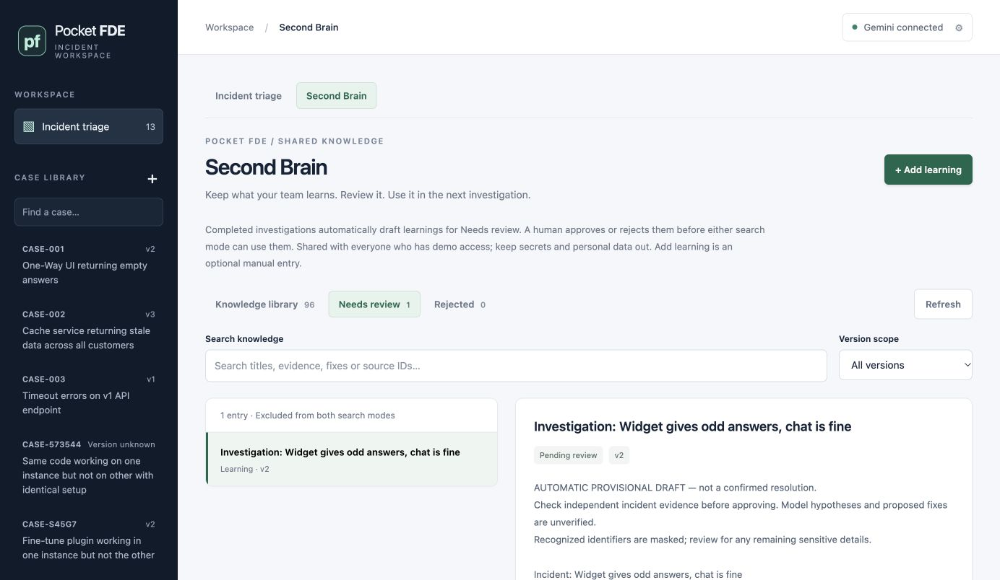
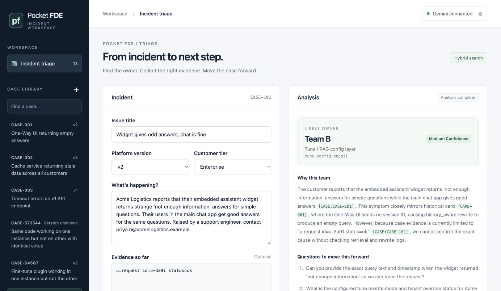

# Second Brain public release verification

Verified 7 October 2026 at https://pocket-fde-adarsh.vercel.app/.
Application commit: `05d41a3`; production deployment: `dpl_CFJ1q1gfsQaTufuHYvEqkU5qu7wQ`.
Pushed to GitHub `dev-adarsh`; the local branch is `dev/Adarsh`. Documentation-only commits after this application commit do not change the deployed runtime.

| Check | Observed result |
|---|---|
| Live hosted Hybrid CASE-101 | Team B, four diagnostic questions, full `gemini-3.5-flash`, 10,077 measured tokens |
| Automatic learning | One persistent provisional draft, visible in shared Needs review |
| Human decision | Left pending; no automated approval or claimed confirmed resolution |
| Review behavior | Isolated private cloud test preserved approval and rejection across instances; conflicting decisions blocked |
| Repeated capture | Retry reused the original draft without another model call |
| Retrieval | Both modes ready, same reviewed corpus; pending draft excluded |
| Private history | Snapshot reload works; a second unlocked workspace cannot read it |
| Public access | Existing code works; anonymous shared-knowledge access returns 401 |
| Desktop browser | Public review queue shows automatic draft and unverified-evidence warning |
| Mobile browser | 390-pixel viewport has no horizontal overflow; both review actions present |
| Errors | No captured browser errors or hosted error entries |
| Regression checks | 104 passing tests; JavaScript syntax, whitespace and upload privacy checks pass |

[Hosted and isolated-cloud check report](../pocket-fde/web/evaluation/automatic-learning-release-20261007.json). Local test notes were not uploaded. Saved-history controls retain their position. **Add learning** remains an optional manual entry. Actual incident evidence and applicability must be checked by a person before approval. The demo uses a shared access code and entered reviewer names rather than verified accounts or separate reviewer roles.

The following records the earlier release and remains historical evidence.

# Previous public release verification

Verified 7 October 2026 at https://pocket-fde-adarsh.vercel.app/.
Application commit: `72d2b0e`; production deployment: `dpl_Gzxu4fpX9i7to8PiJeuvKqoTK8qe`.

| Check | Observed result |
|---|---|
| Anonymous public page | Loads the incident workspace; model calls require the demo access code |
| Keyword and Hybrid retrieval | Both ready; same 96 reviewed sources |
| Hosted Keyword CASE-107 | Team G, four diagnostic questions, private save and saved-result reload |
| Public browser Hybrid CASE-101 | Team B, medium confidence, four diagnostic questions; 4,809 tokens, 3.9 seconds |
| Actual model disclosure | Lite fallback shown explicitly when full Flash is quota-limited |
| Browser refresh | Selected case, Hybrid mode and completed analysis restored; saved analysis listed |
| Browser errors | No captured console errors |
| Private history isolation | Second authenticated workspace cannot list or read the first workspace's saved result |
| Regression checks | 90 passing tests; JavaScript syntax and whitespace checks pass |

The access code is kept in an ignored private local note. No model API key or session signing key is included in this evidence. These selected development checks demonstrate a working release, not general model accuracy or a real participant study. See the [retained hosted checks](../pocket-fde/web/evaluation/README.md) and the validation limitations and remaining submission work in the [project report](../PROJECT_REPORT.md#7-limitations-and-remaining-submission-work).

## Approved repository cleanup — 7 October 2026

144 approved tracked files were removed from `dev-adarsh`: unrelated meeting/program material, retired experiments, unused prototypes, duplicate tools and intermediate output. The root README and project report consolidate current documentation. No application/runtime code, tests, deployment configuration or indexed knowledge was changed.

- All 175 protected runtime/deployment files remained byte-identical to the pre-cleanup snapshot (`a247c92`).
- All 96 bundled knowledge sources retained the same corpus fingerprint; all 13 catalog cases remained unchanged.
- The complete 104-test suite passed in the cleaned branch. A fresh local server started and both actual Keyword and MiniLM Hybrid source routes succeeded with the same corpus.
- The future deployment upload retained required runtime files and excluded private credentials and local data.
- The existing public URL, script, both retrieval modes, access gate/code and shared learning were checked successfully, without additional model calls.
- The Vercel project was not Git-linked at the time of cleanup. Its active production deployment remained `dpl_CFJ1q1gfsQaTufuHYvEqkU5qu7wQ`; this source/documentation cleanup did not replace the live build or modify cloud records.

The repository cleanup prepares the development branch for review before a separate merge to `main`.
